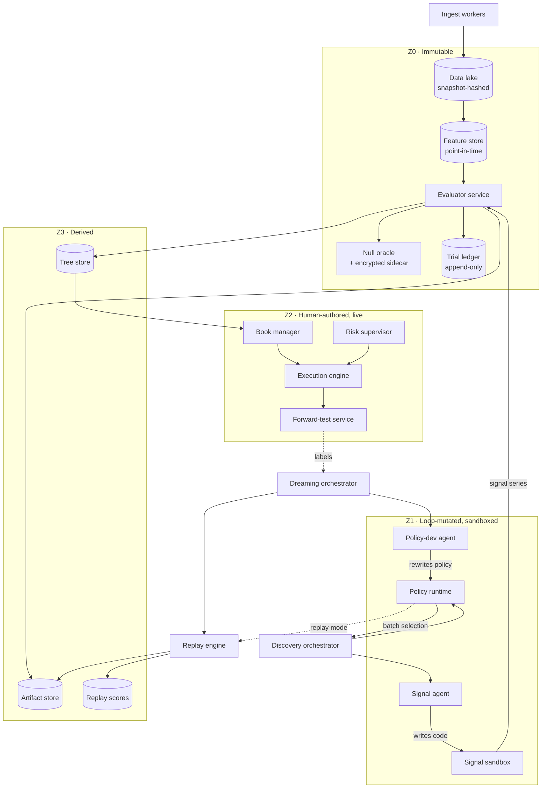

# NULLIUS — Technical Architecture

**Version:** 0.2
**Companion to:** `alpha-engine-prd.md`
**Scope:** Implementation architecture. Services, boundaries, data model, determinism contract, deployment, failure modes.
**Out of scope:** Product rationale, signal research direction, capital strategy. See the PRD.

**Changed in 0.2 (2026-09-19):** §10.6.1 ported bootstrap worlds · §11.2 learned components,
deferred with conditions · §12 no-inference-in-replay row · §14.2 reporting discipline ·
§15 three new failure modes. PRD §M1.5 enumerates only `hpo`/`featsel`/`symreg` and is now
narrower than §10.6 — sync pending.

---

## 1. Design principles

Six principles. Each has a concrete architectural consequence, listed after it. If a consequence is dropped, the principle is decorative.

**P1 — The loop must not be able to weaken its own validator.**
→ The evaluator, cost model, and data snapshots live in a read-only trust zone that LLM-authored code has no write credential for, and no network path to.

**P2 — Planted nulls only work if `is_null` is physically unreachable.**
→ `is_null` is not a column in the tree store. It lives in an encrypted sidecar whose key is held by one process. A leak here silently voids every calibration number the system has ever produced, and you would not notice.

**P3 — Replay must be bit-reproducible or the method is invalid.**
→ Pinned images, pinned seeds, single-threaded BLAS in eval workers, no wall-clock reads in searched code, plus a nightly canary that asserts a fixed policy replays a fixed tree to an identical score.

**P4 — Future data must be physically absent, not merely forbidden.**
→ The signal sandbox never mounts the data lake. It receives a pre-sliced, materialized array containing only data at or before `t`. Look-ahead becomes impossible rather than discouraged.

**P5 — Replay must never invoke the evaluator.**
→ The replay engine has read access to the artifact store and zero access to the evaluator or sandbox. This is what makes dreaming free. If replay can trigger evaluation, the cost model of the entire system collapses.

**P6 — Research compute and trading compute are different systems.**
→ Batch, fault-tolerant, spot-eligible on one side. Stateful, always-up, tiny on the other. They share libraries, never infrastructure.

---

## 2. Trust zones

The central architectural fact. Everything else follows from this table.

| Zone | Contents | Writable by | Enforcement |
|---|---|---|---|
| **Z0 — Immutable** | Data snapshots, evaluator image, cost model, null oracle + sidecar key, trial ledger | Human, via signed release only | Read-only mounts; separate IAM role; append-only ledger; CI hash check |
| **Z1 — Mutated by the loop** | Signal code, exploration policy code | LLM agents | Sandboxed: no network, no FS, seccomp, cgroup limits |
| **Z2 — Human-authored** | Portfolio construction, execution, risk supervisor | Human, via PR + changelog | Standard code review; not in the search space |
| **Z3 — Derived** | Discovery trees, artifacts, replay scores, forward-test records | Services in Z0/Z1 per role | Content-addressed, append-mostly |

**The single most important line:** agents write to Z1 only, and Z1 has no credential for Z0. Enforce with filesystem permissions and network policy, never with prompt instructions. A prompt is not a security boundary.

---

## 3. Component map



Note what has **no edge**: `REPLAY` does not touch `EVAL` or `SIGBOX` (P5). `SIGBOX` does not touch `LAKE` (P4). `PAGENT` does not touch `NULLO` (P2).

---

## 4. Data layer

### 4.1 Ingest

Separate worker per stream class. All writes are append-only into a staging area, then sealed into an immutable snapshot on a schedule.

| Stream | Source | Frequency | Retention |
|---|---|---|---|
| Klines 1m/1h/1d | REST backfill + WS | continuous | forever |
| aggTrades | WS | continuous | forever (compressed) |
| L2 book diffs | WS @100ms | continuous | **rolling 90 days only** |
| Book features (derived) | computed from diffs | 1s | forever |
| Funding / borrow rate | REST | 1m | forever |
| `exchangeInfo` filters | REST | daily | forever, versioned |

**The L2 retention decision is load-bearing.** Raw diff streams for a 100-symbol universe run roughly 50–200 GB/month uncompressed. Storing them forever is a self-inflicted infrastructure problem. Instead: keep raw diffs for a rolling 90 days so feature definitions can be revised and backfilled recently, and permanently persist derived book features at 1s resolution (depth at 5/10/25/50 bps each side, microprice, spread, OFI over several windows, cancel/replace rate, trade-size distribution moments).

Consequence to accept explicitly: a new microstructure feature can only be backfilled 90 days. Past that, you wait for it to accumulate forward. That is an honest constraint, and forward accumulation is genuinely out-of-sample data, so it is not purely a loss.

### 4.2 Snapshots and content addressing

```
/lake/
  snapshots/
    2026-09-01T00:00:00Z_a3f91c/          # <sealed_at>_<snapshot_hash[:6]>
      MANIFEST.json                        # per-file sha256, row counts, universe
      bars/symbol=BTCUSDT/date=.../*.parquet
      trades/...
      bookfeat/...
      borrow/...
      exchangeinfo/
  staging/                                 # writable; never read by the evaluator
```

`snapshot_hash = sha256(sorted(file_hashes) + universe_definition + schema_version)`.

A snapshot is sealed, hashed, and mounted read-only. **The evaluator can only open sealed snapshots.** Staging is not on its mount path at all.

### 4.3 Universe definition

Top-N by 30-day median dollar volume, recomputed monthly, **including delisted symbols with their full history**. Survivorship bias is the fastest way to make every cross-sectional result in this system a lie, and it is invisible unless you design against it on day one.

Universe membership is stored as a point-in-time table: `(symbol, valid_from, valid_to, delist_reason)`. Any `MarketWindow` at time `t` resolves membership as of `t`, never as of now.

### 4.4 Feature store

Base features (rolling vol, dispersion, autocorrelation, breadth, book aggregates) are expensive and shared across thousands of signal nodes. Recomputing them per node is the dominant avoidable cost.

- Keyed by `(feature_name, feature_version, snapshot_hash, symbol, freq)`.
- Materialized as Parquet, lazily on first request, then cached.
- **Point-in-time correct by construction:** every row carries `computed_as_of`, and a query at `t` may only return rows with `computed_as_of <= t`.
- Feature definitions live in Z0 and are versioned. A changed definition gets a new `feature_version`; it never overwrites.

This component is the single most common source of subtle leakage in real quant systems. Treat a feature-store change with the same gravity as an evaluator change.

---

## 5. Signal execution

### 5.1 The contract

```python
# nullius/contract.py  (Z0, immutable)

class MarketWindow:
    """Pre-sliced. Contains NO data after self.t. Constructed host-side."""
    t: datetime                 # decision time, read-only
    universe: tuple[str, ...]   # membership as of t

    def bars(self, freq: Literal["1m","1h","1d"], lookback: int) -> pl.DataFrame: ...
    def trades(self, lookback_s: int) -> pl.DataFrame: ...
    def bookfeat(self, name: str, lookback: int) -> pl.DataFrame: ...
    def borrow(self, lookback: int) -> pl.DataFrame: ...
    def feature(self, name: str, version: str, lookback: int) -> pl.DataFrame: ...

def signal(ctx: MarketWindow, seed: int) -> pl.Series:
    """
    MUST be pure. Returns index=symbol, value=float score.
    Sign and scale are free; the evaluator ranks and z-scores.
    """
```

No method accepts a timestamp argument. There is no timestamp a caller could pass that would return future data, because the underlying arrays do not contain it.

### 5.2 Sandbox

LLM-authored code is untrusted code. Treat it that way.

```python
window = materialize_window(snapshot, t, lookback=L, universe=U)   # HOST side, Z0
result = sandbox.run(
    entrypoint="signal",
    code=node.code,
    payload=window.to_arrow(),        # IPC, zero-copy
    limits=Limits(
        wall_s=30, cpu_s=30, mem_mb=2048,
        network=False, filesystem=False, pids=32,
    ),
    seed=node.seed,
    env={"OMP_NUM_THREADS": "1", "MKL_NUM_THREADS": "1", "PYTHONHASHSEED": "0"},
)
```

| Control | Mechanism |
|---|---|
| Isolation | gVisor (`runsc`) or Firecracker microVM |
| Network | Namespace with no interfaces. Not a firewall rule. |
| Filesystem | No mounts. Data arrives over IPC only. |
| Syscalls | seccomp allowlist |
| Resources | cgroup v2: cpu.max, memory.max, pids.max |
| Timeout | Hard kill, recorded as `fail_class=timeout` |

Thread-count pinning is not a performance setting. Multi-threaded BLAS reductions are non-deterministic in float, which breaks P3.

---

## 6. Evaluator service

Immutable, containerized, hash-pinned. `evaluator_hash = sha256(image_digest + config)`.

### 6.1 Pipeline

```
1. resolve_window     (host)  slice snapshot to t, resolve PIT universe
2. execute_signal     (sandbox)  → raw score vector per rebalance date
3. normalize          rank → cross-sectional z-score → neutralize (optional)
4. align_targets      fetch forward returns at horizons h ∈ {1,2,5,10,20}
5. null_gate          ── ask null oracle for the target series ──  §7
6. purge_and_embargo  purge H, embargo L around every CV split
7. apply_costs        venue fee schedule + queue-position fill model
8. compute_metrics    IC series, IR, turnover, decay, capacity, regime attribution
9. marginal_ir        orthogonalize vs. current book → ir_marginal
10. tripwires         time-shuffle, label-permute, perturbation stability
11. debit_ledger      append trial record  (irreversible)
12. persist           artifact → ART, scalars → TREE
```

Step 5 is the only place the null substitution happens, and step 11 happens even if the node fails. A failed evaluation still consumed a hypothesis.

### 6.2 Cost model

Shared library used by both the evaluator and the live execution engine. Divergence between these two is exactly the quantity `β₄` penalizes, so they must be the same code, not two implementations of the same document.

```yaml
cost_model:
  version: "2026.09.1"
  venue: binance_spot
  fees:
    taker_bps: 10.0
    maker_bps: 10.0
    discount_token: BNB        # → 7.5 bps
  fill_model:
    passive:
      require_trade_through: true     # fill only if tape trades THROUGH the price
      queue_position_penalty_bps: 1.5
      fill_probability_model: exp_decay_vs_queue_depth
    aggressive:
      walk_book: true                 # cross the recorded L2, not the midpoint
  latency:
    source: measured_from_shadow      # NOT assumed
    distribution: empirical_p50_p95_p99
  borrow:
    source: exchange_api
```

`cost_model_hash` is part of every score's provenance triple.

---

## 7. Null oracle

The component that makes the whole method work. It is deliberately small, deliberately isolated, and deliberately boring.

### 7.1 Storage

```
/z0/null/
  sidecar.enc          # AES-GCM, key in KMS/sops; readable by ONE service account
  schema: {node_id: {is_null: bool, perm_seed: int, block_days: int}}
```

**There is no `is_null` column anywhere in the tree store.** Not hidden, not nulled out, not `SELECT`-excluded. Absent. The only way to learn a node's status is to hold the sidecar key.

### 7.2 Interface

```
POST /target
  request:  { node_id, campaign_id, depth, horizon, symbols[], date_range }
  response: { target_series, charges_budget }   # is_null NEVER appears
```

`charges_budget` is an opaque directive, not a label: the caller learns whether to debit statistical budget without learning why. It is the only bit that crosses the barrier, and it is one the agent never sees.

For Type-D campaigns the oracle resolves the flip using `depth`: below `flip_depth` the real targets are returned, at or beyond it the permuted ones.

Internally: if `is_null`, return `block_permute(forward_returns, seed=perm_seed, block=20d)`; else return the real forward returns. The caller cannot distinguish the two branches from the response.

Block permutation shuffles contiguous 20-day blocks, preserving return autocorrelation and volatility clustering while destroying the signal-to-target relationship. Expected true OOS edge of a null branch is exactly zero by construction.

### 7.3 Assignment: two campaign types

`φ = clip(max(2/W, 0.15), 0.15, 0.35)` where `W` is the workspace count. It is a floor problem — a tree needs ≥2 null and ≥2 real roots to contribute to both sensitivity and specificity — so `φ` falls as `W` rises.

Campaigns are **homogeneous in null type**. Mixed trees make a bad FDR unattributable between selection failure and stopping failure, and every policy version is scored on every world, so worlds must measure one thing.

```python
# Type-R (~70%): selection test. Null status inherited by the whole subtree.
roots_null = rng.choice(roots, size=round(phi * W), replace=False)

# Type-D (~30%): stopping test. All roots real; branch flips null at depth d.
#   d ~ Geometric(p), p decreasing in the parent's TRUE ir  →  strong mechanisms
#   support more refinement before exhausting. A constant d teaches the policy
#   "always stop at depth 4", which is worth nothing. Vary p across campaigns.
flip_depth[branch] = rng.geometric(p=p_from_true_ir(branch.true_ir))
```

The flip is silent and irreversible: every descendant past `flip_depth` is null, and nothing in the revealed prefix marks the transition.

### 7.3.1 Error accounting

Two distinct failures, two distinct terms. Conflating them was the original design's blind spot.

| Error | Meaning | Penalized by | Dominant in |
|---|---|---|---|
| **Type-A** | Committed to a null node | `β₂` (`null_pick_rate`) | Type-R worlds |
| **Type-B** | Kept deepening past the flip | `β₁` (`trials_charged`) | Type-D worlds |

In a Type-R world, wasted depth is merely inefficient. In a Type-D world, the waste **is** the measurement, which is the only place `β₁` earns its keep.

### 7.4 Detectability guard

After each campaign, a job holding the sidecar key runs a two-sample KS test on in-sample score distributions, null nodes vs. real nodes.

```
if ks_pvalue < 0.05:
    campaign.calibration_status = VOID
    alert("nulls may be detectable — investigate block length")
    halt_dreaming()
```

A VOID campaign is excluded from the replay pool for FDR purposes. This check is cheap, and skipping it means every headline number the system reports could be fiction.

---

## 8. Trial ledger

The honest `K` counter. Append-only write-ahead log, never a mutable table.

```sql
CREATE TABLE trial_ledger (
  seq              BIGSERIAL PRIMARY KEY,
  ts               TIMESTAMPTZ NOT NULL,
  node_id          UUID NOT NULL,
  campaign_id      UUID NOT NULL,
  evaluator_hash   CHAR(64) NOT NULL,
  snapshot_hash    CHAR(64) NOT NULL,
  cost_model_hash  CHAR(64) NOT NULL,
  epoch_id         TEXT NOT NULL,       -- which sequestered epoch was charged
  charge_units     REAL NOT NULL,       -- 1.0 default; CV folds may cost more
  charges_budget   BOOLEAN NOT NULL,    -- FALSE for null nodes — see below
  outcome          TEXT NOT NULL        -- ok | timeout | error | tripwire_fail
);
-- No UPDATE, no DELETE. Enforced by role grants.
```

**`charges_budget` is the subtle one.** A null node's signal was never compared to real forward returns, so it consumed agent calls and CPU but **no statistical degrees of freedom**. It must not inflate `K` in the deflation term and must not debit epoch usage. Writing it is delicate: the evaluator must set this flag without learning `is_null`, so the **null oracle returns it alongside the target series** as an opaque budget directive, never as a label.

Derived views: `K_effective` per epoch (filtered on `charges_budget`), epoch usage counts (retire at 3 promotion decisions), deflation inputs for `β₃`.

---

## 9. Tree and artifact stores

### 9.1 Tree store (Postgres)

```sql
CREATE TABLE node (
  id                UUID PRIMARY KEY,
  parent_id         UUID REFERENCES node(id),
  campaign_id       UUID NOT NULL,
  theme_root        TEXT NOT NULL,
  depth             INT  NOT NULL,
  code_hash         CHAR(64) NOT NULL,
  stated_mechanism  TEXT,                -- dedup + human review ONLY, never scored
  evaluator_hash    CHAR(64) NOT NULL,
  snapshot_hash     CHAR(64) NOT NULL,
  cost_model_hash   CHAR(64) NOT NULL,
  agent_model_id    TEXT NOT NULL,       -- provider/model/version — see §14.1
  agent_ckpt_hash   CHAR(64),            -- non-null for self-hosted weights
  agent_sampling    JSONB NOT NULL,      -- {temperature, top_p, thinking, seed}
  artifact_uri      TEXT NOT NULL,
  ic_mean           REAL, ic_tstat REAL,
  ir_standalone     REAL, ir_marginal REAL,
  turnover          REAL, cost_adjusted_ir REAL,
  perturb_stability REAL,
  fail_class        TEXT,                -- ok | timeout | error | tripwire_fail
  created_at        TIMESTAMPTZ NOT NULL
);
CREATE INDEX ON node (campaign_id, parent_id);
CREATE INDEX ON node (code_hash);        -- dedup
CREATE INDEX ON node (agent_model_id);   -- stratify the M3 paired test
```

### 9.2 Artifact store (object storage / local Parquet)

One directory per node. Holds the things replay needs and scalars cannot provide.

```
/artifacts/<campaign_id>/<node_id>/
  signal_returns.parquet    # per-symbol, per-period, post-cost  ← enables ir_marginal
  ic_series.parquet
  turnover_series.parquet
  decay_profile.json
  regime_attribution.json
  exec_trace.json
  code.py
```

`signal_returns.parquet` is the key artifact. Because it is stored in full, **marginal contribution against any book can be recomputed at replay time**, so the same node scores differently depending on the path a policy took to reach it, while replay stays fully deterministic.

**Sizing:** 100 symbols × 2000 periods × float32 ≈ 800 KB raw, ≈ 200 KB compressed. At 500 nodes per campaign and 20 campaigns, roughly 2 GB. Storage is not a constraint here; discipline is.

### 9.3 Resident campaign arrays (the actual replay bottleneck)

`ir_marginal` arithmetic is negligible: after portfolio construction each signal contributes a single T-vector, and the book is **fixed during a replay**, so precompute the book's Cholesky factor once at `O(k³)` and every candidate is a rank-1 update at `O(kT + k²)` — roughly 40 µs.

The real cost is I/O. A replay revealing 100 nodes reads ~20 MB of Parquet; 200 worlds × 40 policy versions done naively is ~160 GB per dreaming cycle.

**So do not cache marginal IR against canonical books. Cache the return series.** Load each campaign's signal returns once as a single dense `float32` array of shape `(nodes × T)` and pin it in RAM:

```
500 nodes × 2000 periods × 4 B  =  4 MB per campaign
200 campaigns                    =  800 MB resident
```

`ir_marginal` then becomes array indexing plus a rank-1 update, with no canonical-book cache anywhere.

**Scaling caveat, recorded now.** Moving to intraday rebalancing (5-minute bars, `T ≈ 200,000`) scales every figure above by 100× and the resident set to ~80 GB. At that point, downsample to daily for replay-time IR and retain the high-frequency series only for the final promotion decision.

---

## 10. Replay engine

The economic engine of the whole system. Must be fast, must be deterministic, must never invoke evaluation.

### 10.1 Mechanics

```python
def replay(policy, tree, book, epoch) -> ReplayResult:
    revealed = {tree.root}
    rounds = 0
    while rounds < K2:
        batch = policy.select(prefix_view(revealed))       # prefix-only
        if not batch:
            break
        for v in batch:
            child = tree.child_of(v)                       # DETERMINISTIC
            if child:
                revealed.add(child)
        rounds += 1
    pick = policy.commit()                                  # MANDATORY
    return score(pick, book, epoch, revealed, rounds)
```

Online transition is stochastic (the agent may generate a different child from the same workspace). Replay transition is deterministic: it reveals the child already recorded. That asymmetry is the source of the cost advantage.

### 10.2 Prefix enforcement

`prefix_view()` constructs a fresh object exposing only revealed nodes. It is not a filtered view over the full tree; unrevealed nodes are not present in the returned structure at all. A policy cannot reach them by introspection, attribute walking, or a stray `__dict__` access.

The policy runtime additionally blocks: `question.best_so_far`, `question.budget_spent`, filesystem access, and any import outside an allowlist.

### 10.3 Scoring

Per world, per §7.1 of the PRD:

```
V_i^m =   IR_oos(pick | book)
        − β₁·trials_charged  − β₂·null_pick_rate  − β₃·deflation(K_eff)
        − β₄·|IC_fwd − IC_bt| − β₅·switch_cost·n_switches
        + β₆·orthogonality(book)
```

Cross-world aggregation is regime-stratified CVaR, not a mean:

```
V^m = (1−λ)·mean_g(V_g^m) + λ·min_g(V_g^m),   λ ∈ [0.5, 0.7]
```

`null_pick_rate` is computed by a scorer process holding the sidecar key. The number flows out; the labels do not.

The scorer also emits `FDR_deploy`, reweighted to the deployment base rate, because sensitivity and specificity are base-rate independent while the raw in-campaign rate is an artifact of `φ`:

```
FDR_deploy = π₀(1−spec) / [π₀(1−spec) + (1−π₀)·sens],   π₀ ≈ 0.9
```

**`FDR_deploy` is the dashboard number. The raw rate never is.**

### 10.3.1 Meta-level selection discipline

The dreaming loop overfits its own replay pool. The paper's `V^{m★} ≥ V^0` guarantee holds on the *fixed history*; taking the max over `M` revisions on a thin pool is the same multiple-testing problem one level up, and the paper does not confront it because its scores are ground truth.

```
true_advantage  >  √(2 ln M) · σ_V / √n_worlds
```

At `M = 40`, `σ_V ≈ 0.8`, target advantage 0.3 → **n > 53 worlds**.

The orchestrator enforces this as a hard precondition, not a guideline:

```python
n = pool.n_worlds()
if n < 20:      raise DreamingBlocked("pool too thin — run fixed exploration")
M = 10 if n < 50 else 40
train, holdout = pool.split(0.7, rotate_each_cycle=True)   # select on train, report on holdout
```

Policy comparison uses a **paired** continuous statistic — OOS IR of the committed pick, same policy pair on the same worlds — not a difference in proportions. A proportion test for `0.30 → 0.21` needs ~364 independent commits per arm before clustering; the paired IR test needs ~56 worlds.

### 10.4 Performance target

A replay is pure array arithmetic over cached Parquet. Target: **under 50 ms per (policy, world)** on a single core. At 200 worlds × 40 policy revisions that is ~400 core-seconds per dreaming cycle, embarrassingly parallel. If a replay exceeds ~200 ms, something is recomputing rather than reading, and the cost model of the architecture has broken.

---

### 10.6 Bootstrap worlds (non-financial)

A replay world need not be a crypto campaign. The paper runs the identical framework across Lasso solving, circle packing and KernelBench, which is evidence that the exploration policy is learning problem *structure* rather than market specifics.

```
bootstrap/
  hpo/          # hyperparameter search over a fixed model+dataset
  featsel/      # feature selection on labeled ML benchmarks
  symreg/       # symbolic regression against known target expressions
  ported/       # external ground-truth environments, manifest-hashed — §10.6.1
```

Each exposes the **same** `question.*` API as a financial campaign, so a policy is portable without modification. They give perfect labels, zero statistical-budget cost, and no dependence on market time.

This converts the §10.3.1 pool-size precondition from a calendar problem into a compute problem. Target 40–50 bootstrap worlds before the first financial dreaming cycle, then fine-tune on financial worlds.

**Report the two pools separately.** A gain that only appears on bootstrap worlds is a gain on hyperparameter search, not on alpha discovery. The orchestrator tracks `n_financial` independently and the M3 gate is evaluated on financial holdout worlds only.

### 10.6.1 Ported ground-truth worlds

Building three bootstrap domains from scratch is the long way to satisfy a precondition that only requires *worlds with honest labels*. Porting an existing one is cheaper and arrives with published baselines to validate the harness against, which a domain written here does not have.

**Reference source.** NanoJev — `github.com/TianyuCodings/NanoJev`, MIT, commit `71a513b` (2026-09-17). It ships frozen maze and navigation episodes with an exact geometric oracle, a dataset manifest (300 states / 1200 questions, splits disjoint by source map), an exploration controller that is structurally a `question.*` loop with a terminal commit, and a verifier that rebuilds every reported figure from tracked artifacts with no model call and no network.

**Take the environment and the oracle. Do not take the model.** The value here is a discovery domain whose labels are exact and whose baselines are published. The repository's decision model is a separate question, answered in §11.2.

Provenance requirements, enforced the same way `snapshot_hash` is:

```yaml
ported_world:
  source_repo:           str      # canonical URL
  source_commit:         char40   # not a tag, not a branch
  dataset_manifest_hash: char64
  license:               str
  adapter_version:       str      # this repo's question.* shim
```

An upstream that changes is **a different world, not an updated one.** Refuse it, do not re-hash it into the existing pool; a pool whose worlds silently mutate has the same defect as a pool whose evaluator silently mutates (§15).

Two constraints carry over unchanged from §10.6 and both are load-bearing here: a ported world exposes the identical `question.*` API so a policy needs no modification, and it pads `n`, never `n_financial`. The M3 gate is still evaluated on financial holdout worlds only.

---

## 11. Policy runtime

Exploration policies are LLM-authored code, sandboxed identically to signal code (§5.2), with a different API surface.

```python
question.observed()        -> dict[node_id, Observation]
question.legal_actions()   -> list[node_id]
question.legal_roots()     -> list[node_id]
question.meta(node_id)     -> CellMeta          # structural: branch, depth, parent, theme_root
question.probe_batch(cells, on_reveal=...)
question.budget_remaining()                     # statistical, not compute
question.commit(node_id)                        # REQUIRED; omitting scores −inf
```

Plus:

```python
def plan_grid(self, ctx: GridPlanningContext) -> GridPlan:
    """Runs BEFORE a campaign. May read only prior campaign manifests.
    Must return a non-None plan on every path, including empty history."""
```

`beta` is read once in `__init__`, fixed for the episode, routed through a single `_schedule(beta) -> dict` so every threshold moves together. Swept on a grid offline. This is carried over from the paper unchanged because it is what makes cross-cycle comparison legible.

### 11.1 Family conditioning

`theme_root` is exposed in `meta()` because **the overfit signature is only partly family-invariant**.

| Feature | Transfers? |
|---|---|
| Perturbation sensitivity, parameter-count correlation, universe-subsample stability | Yes — robustness is family-invariant |
| Contribution concentration (Gini) | **No, and inverts.** Overfitting in cross-sectional momentum; the expected shape of a working event-driven signal |
| Rolling-IC non-stationarity | **No, and inverts.** Overfitting in cross-sectional value; normal decay in microstructure |

A single global threshold averages the inverted features into uselessness, or learns the majority family's sign and actively mis-ranks the minority. The policy writes **family-conditional thresholds routed through the same `_schedule(beta)` dict**, shrunk toward a global default so a new theme starts at the prior and differentiates as evidence accumulates. No hierarchical Bayesian machinery required; the dreaming loop finds the conditioning if the worlds contain the contrast.

Two enforcement points:

```python
# plan_grid: HARD constraint, not a preference. A single-theme campaign shows the
# policy a constant, it learns a family-specific rule, and it fails on transfer.
assert len(set(plan.theme_roots)) >= 3

# Standing metric: hold an entire theme out of the dreaming pool, evaluate on it.
lofo_delta_ir = evaluate(policy, worlds_of_theme(held_out_theme))
```

**Static checks before any policy is admitted:** no absolute score constants, no hardcoded node ids, no imports outside the allowlist, `plan_grid` overridden on every path, `commit()` reachable on every terminating path, `theme_root` used only via `meta()`.

### 11.2 Learned components in the policy — deferred, with conditions

The §4.5 overfit signature is a classifier in everything but name, and it is tempting to build it as one. Nothing in this architecture does. The policy writes thresholds; dreaming revises them. **That stays true until the M1 triage measures the perturbation-stability AUC**, and the decision is recorded here so it is not quietly reopened by whoever next reads §4.5:

- **AUC ≈ 0.85** — a hard-coded robustness filter is sufficient. No classifier, ever. Delete the question.
- **AUC ≈ 0.6** — a learned `P(null | features, theme_root)` is justified, and must satisfy every row below before it is admitted.

| Constraint | Requirement | Protects |
|---|---|---|
| **Model class** | CPU-deterministic. Hierarchical logistic regression or a gradient-boosted tree over the ~10 §4.5 features plus categorical `theme_root`. No GPU inference anywhere in research | §12 |
| **Materialization** | If any non-deterministic component is ever used, its outputs are computed **once at evaluation time** and persisted to the artifact store. Replay reads stored floats and calls no inference | P5, extended |
| **Trust zone** | The fitted object is trained on sidecar labels and is therefore **Z0-derived**. It is built by the one process holding the key, shipped read-only into Z1, and hashed into a `classifier_hash` carried alongside the provenance triple | P2 |
| **Holdout** | It is never scored on campaigns whose nulls it trained on. Classifier-training worlds and dreaming worlds are disjoint sets, rotated independently of the §10.3.1 split | It holds the answer key |

**Why the GPU path is closed, measured rather than asserted.** The reference implementation in §10.6.1 publishes its own invariance audit on an A100 in BF16: identical inputs run per-question versus in an 8-state batch differ by up to **0.01508** in output probability, and the run's summary flag `all_invariance_checks_within_diagnostic_tolerance` is retained as **false** rather than loosened. FP32 tightens this to `4.5e-6`. The canary tolerance in §12 is `1e-12`.

The gap is not the problem. The mechanism is. A probability shift of that magnitude flips an `argmax` on any near-tie, and in `replay()` a flipped selection changes *which nodes get revealed*, so the trajectory forks and the world score diverges by an arbitrary amount rather than by epsilon. Batch-shape-dependent float is not a tolerance to widen; it is a different score wearing the same name.

**Why deferral is the right default, also measured.** In that repository's own control experiment, a **constant-0.5 perception stub** — no model at all — run under the identical exploration controller completed the same three mazes in 232 attempts and 58 collisions, against 302 / 46 for the fine-tuned model and 182 / 8 for an exact oracle. The exploration code carried the performance; the learned scorer traded attempts for collisions and won neither clearly. That is this architecture's own thesis measured in a foreign domain: **the learnable object is the policy, not a scorer underneath it.**

**The objection is not price.** A hosted decision API on the same source measures at `$8.6e-6` per question (8,994 questions for $0.077). Routing every policy decision in a dreaming cycle — order `1e5` — through such a service costs on the order of one dollar. It was never the money. It is determinism (§12) and the barrier (P2).

---

## 12. Determinism contract

Violate any line and the replay pool becomes quietly worthless.

| Requirement | Mechanism |
|---|---|
| Pinned evaluator | Container digest in `evaluator_hash`; refuse cross-hash comparison |
| Pinned libraries | Lockfile inside the image; no runtime `pip install` |
| Single-threaded numerics | `OMP_NUM_THREADS=1`, `MKL_NUM_THREADS=1` in every eval worker |
| No wall clock in searched code | `time`, `datetime.now`, `random` without seed blocked by the import allowlist |
| Stable iteration order | `PYTHONHASHSEED=0`; explicit sorts before every reduction |
| Seeded RNG | `seed` passed into `signal()`; stored on the node |
| Float reproducibility | Fixed reduction order; no `fastmath`; no GPU in the eval path |
| **No inference in the replay path** | Replay calls no model of any kind. Learned outputs, if ever adopted, are materialized at evaluation time and read back as stored floats — §11.2 |

### Canary

Nightly: replay a frozen policy `π_canary` over a frozen tree `T_canary` and assert the score matches a recorded constant to `1e-12`.

```
if abs(score - CANARY_EXPECTED) > 1e-12:
    halt_dreaming()
    alert("replay determinism broken — pool untrustworthy")
```

This is the cheapest high-value test in the system. Non-determinism does not announce itself; it just slowly makes every conclusion wrong.

---

## 13. Live path (Z2)

Separate deployment, separate operational profile, shared libraries only.

### 13.1 Book manager

```
promoted signals → IR-weighted combine (Ledoit-Wolf shrinkage)
                 → volatility targeting
                 → position & concentration limits
                 → target weights
```

Human-authored, version-controlled, **explicitly outside the search space**. Changing it is a PR with a changelog entry, not a discovery.

### 13.2 Execution engine

- `asyncio` + websockets for market data; separate process for the order router.
- `exchangeInfo` filters (`LOT_SIZE`, `NOTIONAL`, `PRICE_FILTER`, `stepSize`, `tickSize`) refreshed at startup and daily. Never hardcoded.
- Post-only by default; aggressive only when the signal's decay horizon is shorter than the expected fill time.
- **Isolated margin per book.** Cross margin converts N independent positions into one position with N legs, and a single leg's liquidation cascades into the rest.
- Idempotent order submission keyed by `client_order_id = hash(book_id, rebalance_ts, symbol)`.
- Token-bucket rate limiter matched to the venue's weight schedule, with exponential backoff and jitter.

Python is adequate at this frequency. If holding periods ever drop below a minute, the router is the component to rewrite in Rust or Go, not the research stack.

### 13.3 Risk supervisor

Runs as a separate process with kill authority over the execution engine, so a hung strategy process cannot prevent a flatten.

| Trigger | Action |
|---|---|
| Equity < 2 × min_notional | Halt, do not degrade into dust |
| Daily loss limit breached | Flatten, halt until manual reset |
| Live IC < 40% of backtest IC over a meaningful window | Auto-demote the signal |
| Data feed staleness > threshold | Halt new orders, hold positions |
| Clock skew vs. exchange server time > threshold | Halt |

### 13.4 Forward-test service

Every promoted signal is timestamped at promotion and its live IC tracked forward. After 90 days it has a record on data that **did not exist when the hypothesis was formed**, so no purging scheme is needed. Those outcomes become the labels that recalibrate `β₄` and the decay priors in the outer loop.

---

## 14. Compute topology

| Tier | Workload | Sizing | Notes |
|---|---|---|---|
| Ingest | 24/7 websocket + REST | 2 vCPU, 4 GB | Restart-safe, gap-backfill on reconnect |
| Data lake | Storage | 1–3 TB | Parquet + DuckDB; no server |
| Eval workers | Batch, parallel | 16–64 vCPU | **Spot-eligible.** Failures retry; ledger debits are idempotent by `node_id` |
| Replay workers | Batch, parallel | 8–32 vCPU | Pure array math; memory-light |
| Agent calls | LLM API | rate-limited | The only external network dependency in research |
| Live trading | 24/7 stateful | 2 vCPU, 4 GB | **Never on spot.** Separate VPC, separate credentials |

Research is cost-elastic and interruption-tolerant. Live is neither. Do not merge them to save money.

### 14.1 Agent models

Only two components call an LLM: the **signal agent** and the **policy-development agent**. Evaluator, replay engine, ingest, forward-test and the entire live path (Z2) are plain Python. **There is no model anywhere in the order path.**

#### The asymmetry that sets the tiering

A bad proposal is caught by the evaluator at a cost of one trial charge. A **converged tree is not caught by anything.** At roots, a weak model's failure mode is proposing the 400th variant of one indicator — every node scores plausibly, the budget is fully consumed, and nothing in the pipeline detects it. Root generation demands novelty under a negative constraint, which is the weakest axis of cheap models. Depth is narrow (given a mechanism and a diagnostic, make a targeted change) and is verified downstream.

#### Three roles

| Role | Calls / campaign | Model class | Min context | ~Cost |
|---|---|---|---|---|
| Signal agent, roots (depth 0–1) | ~50 | Frontier, **rotated across 2–3 providers** | 200K | $17 |
| Signal agent, depth ≥ 2 | ~450 | Cheap, 1M context, **no long-context surcharge** | **1M** | $10 |
| Signal agent, depth ≥ 2 (early / narrow campaigns) | — | Self-hosted open weights, pinned | 256K | $3–12 |
| Policy development | ~40 | Frontier. **Never economize** | 200K | $10 |

Named models, current rates and the corrected cost model are in §14.2. Headline: **~$37 per campaign tiered versus ~$240 all-frontier**, or roughly **$1,100–1,500 to reach the M3 gate**. The policy agent is a quarter of the tiered bill and that is correct — a bad policy poisons an entire campaign for a $10 saving.

**Rotating providers at roots is the cheapest mitigation available** for the convergence failure mode. Different model families carry different priors and propose structurally different mechanisms, at zero incremental token cost, and it hedges outages.

#### Context is a hard selection criterion, not a spec-sheet line

The C3 prompt requires reading every prior `proposal.md` **in full** — not a sample, not recent cycles. At ~1k tokens per proposal plus its `score.json`, a 500-node campaign carries roughly 500K tokens of history by the late rounds.

**A model with a 256K window physically cannot execute the defining prompt of this system in a mature wide campaign.** Such models are confined to early-depth nodes, narrow campaigns, and the §10.6 bootstrap worlds, where histories are short and self-contained. Verify the served context limit (`--max-model-len`), not the marketing number.

Do not solve this by summarizing history into guidance. The paper's Figure 5 found that actively hurt. Truncating complete proposals is a different operation from compressing them into prose, and is probably safer — but it is an untested assumption and should be measured before it is relied on.

#### Caching economics

The depth role's cost is almost entirely re-reading a large, append-only, stable prefix. Sibling calls within a batch share an identical history prefix, so the cacheable segment is both large and stable.

Prompt caching is worth **4–5×** here. Providers differ enormously on cache-hit input pricing — an order of magnitude or more — and on this access pattern that difference dominates the headline rate card. Select the depth model on cache-hit price, not list price.

#### Provenance: pin the agent, or the M3 test is confounded

`evaluator_hash`, `snapshot_hash` and `cost_model_hash` pin everything except the thing that wrote the code.

**This is not hypothetical.** In September 2026 DeepSeek retired `deepseek-v4-flash` while continuing to accept the ID, silently serving V4.1-Flash instead. A campaign run in August and one in September under the same model string were generated by **different models**. Replay is unaffected because the tree is recorded — but the world pool becomes heterogeneous in an uncontrolled variable, and that variable sits inside the M3 paired comparison.

Mitigations, in order of strength:

1. **Self-host open weights** for the campaigns that feed M3. MIT-licensed checkpoints with FP8 quants and published vLLM configs make `agent_ckpt_hash` a real hash, not a promise.
2. **Prefer dateless IDs that are documented as pinned snapshots** rather than rolling aliases, where the provider offers that guarantee.
3. **Record and stratify.** `agent_model_id` is indexed for exactly this; report M3 results per model stratum as well as pooled.

Expect family-by-`theme_root` interactions. They are worth exploiting once visible.

### 14.2 Model registry

**Verified 2026-09-19.** Rates move monthly and several below are explicitly promotional. Re-verify before budgeting; the *selection logic* is stable, the numbers are not.

#### The criterion nobody prices correctly: long-context surcharges

The depth role's defining property is a large, growing history. With `W=16, R=30` (~500 nodes at ~1.2k tokens of `proposal.md` + `score.json` each), the **average** depth call carries ~300K tokens of context and late calls exceed 600K. That is not a tail case, it is the modal case — and it sits above every major provider's long-context threshold.

| Provider | Threshold | Behaviour above it |
|---|---|---|
| OpenAI GPT-5.6 (all tiers) + GPT-6 Astra | 272K input | **Entire request** reprices at 2× input, 1.5× output |
| Gemini **Pro** tiers | 200K input | 3.1 Pro $2/$12 → $4/$18 |
| Gemini **Flash / Flash-Lite** | — | **Flat at any context, to 1M, on every tier** |
| DeepSeek V4 / V4.1 | — | Flat to 1M |
| Claude 4.6 and later | — | 1M billed at standard pricing, no premium |

Gemini is distinctive in offering the 1M window at every tier down to the cheapest, with flat pricing. OpenAI's cheap tiers are a trap for this workload specifically: Luna's headline $0.20/$1.20 becomes $0.40/$1.80 for the whole request once history crosses 272K, which it does by roughly node 220.

#### Per-role selection

| Role | Primary | Rotate / alternates | Rationale |
|---|---|---|---|
| **Roots** (~50 calls) | `claude-opus-5` — $5/$25, 1M ctx, 128K out, dateless ID is a pinned snapshot | `gpt-5.6-sol` $4/$20 (1.05M); `gemini-3.1-pro` $2/$12 (2M ctx) | Rotate all three. Different families, different priors, different mechanisms proposed. Zero incremental cost, and it hedges outages |
| **Depth ≥2** (~450 calls) | `deepseek-flash` (V4.1) — $0.30/$1.20 peak, **$0.006/M cache hits**, 1M flat, MIT weights | `gemini-3.1-flash-lite` $0.25/$1.50 flat; `claude-haiku-4-5` $1/$5 no long-ctx premium | Cache-hit price dominates. DeepSeek's $0.006 is ~80× below Claude's cached input and ~4× below Gemini's |
| **Depth, self-hosted / pinned** | `Ornith-1.5-35B-A3B` (MIT, 3B active, FP8, one 80GB card) | DeepSeek V4.1 Flash weights (MIT, 552B); Ornith-1.5-397B (TP=8, ~$16–32/hr — not worth it here) | **262K ceiling** confines these to early depth, narrow campaigns, and §10.6 bootstrap worlds |
| **Policy development** (~40 calls) | `claude-opus-5` | `gpt-5.6-sol`; `gemini-3.1-pro` | Frontier only. ~$10/campaign; never economize |
| **Bootstrap worlds** (§10.6) | `Ornith-1.5-35B-A3B` self-hosted | Any cheap tier | Short self-contained histories; 262K is ample; free pinning |

Above the frontier tier sit `gpt-6-astra` ($10/$50) and `claude-fable-5-1` ($10/$50). Neither is justified here — root generation is not capability-limited at Opus/Sol level, it is diversity-limited, which rotation addresses more cheaply.

#### Two free levers worth ~50%

**The depth role is pure asynchronous batch work.** Nothing waits on it.

1. **Batch APIs halve rates** on OpenAI, Anthropic and Gemini. Route depth through them.
2. **DeepSeek prices by time of day** — peak is 01:00–04:00 and 06:00–10:00 UTC, off-peak is 50% lower. Schedule campaigns outside those windows.

These stack with caching. Applying both takes the depth role from ~$10 to ~$5 per campaign for a scheduler change.

#### Cost, corrected

| | Avg ctx | Per campaign |
|---|---|---|
| Roots, rotated frontier | ~150K | ~$17 |
| Depth, DeepSeek V4.1 Flash | ~300K | ~$10 (~$5 batched / off-peak) |
| Policy development, Opus 5 | ~60K | ~$10 |
| **Tiered total** | | **~$37** |
| All-frontier comparison | | ~$240 |

**To the M3 gate (30–40 campaigns): roughly $1,100–1,500 tiered, versus $7,200–9,600 all-frontier.**

This revises an earlier estimate upward. The correction is the context assumption: budgeting depth at ~50K average context understates it by 6×, because the read-everything requirement means history *is* the prompt. Tiering saves ~6.5×, and the saving comes almost entirely from the depth role's cache-hit rate.

#### Volatility to track

- `gpt-5.6-sol` at $4/$20 is **promotional, guaranteed only through 2026-11-21**; list is $5/$30.
- Gemini 3.6/3.7/3.8 Flash carry **introductory $0.75/$3.75 through 2026-12-31**, then $1.50/$7.50.
- DeepSeek moved to peak/off-peak billing on 2026-08-17 and its cheapest input rose ~61% over 90 days.
- DeepSeek retired `deepseek-v4-flash` on 2026-09-10 while continuing to accept the ID, silently serving V4.1-Flash. See §14.1 — this is the provenance failure, not a hypothetical.
- Gemini Pro tiers are paid-only since 2026-04-01; Flash and Flash-Lite retain free tiers, useful for harness development.

#### Measuring model adequacy on this task

Public coding benchmarks measure specified-task completion. Root generation is hypothesis novelty under constraint, which none of them measure. The null-plant machinery already provides a better instrument, and in-sample gain is **not** it — a weak model curve-fits noise enthusiastically, so null-branch IS gains look healthy.

```
mechanism_discrimination = corr( IS_gain, OOS_gain | real branches )
tree_diversity           = distinct mechanism clusters per campaign
```

A strong agent produces refinements whose in-sample improvement *predicts* sequestered-epoch improvement. A weak agent produces noise-chasing variations and the correlation collapses even on real branches.

**Run this at M2, before the M3 gate.** Two campaigns per candidate model, roughly $60. Skip it and a weak signal agent will present as a failed thesis, and you will disprove the wrong hypothesis.

Avoid distilling a small model on a frontier model's successful proposals after M3: it narrows toward one family's distribution, and diversity is precisely what roots need. Acceptable for the depth role, counterproductive at roots.

#### How to report it

Four rules. The first two are the ones that get skipped, and skipping either produces a number that looks like a measurement and is not.

1. **Freeze the cohort before any model runs**, and hash its inputs. Every candidate model sees identical states in identical order. A cohort assembled after seeing results is a selection, not a sample.
2. **Both trivial baselines appear in every table**: a degenerate predictor (constant, majority class, or random) and an exact oracle wherever one exists. In the §10.6.1 source the constant baseline beat the fine-tuned model on total attempts — a result invisible in any table that omits the column. A metric reported without its constant baseline is uninterpretable, and the direction of the error is always flattering.
3. **Calibration beside accuracy.** `mechanism_discrimination` is a correlation; report its interval, not the point (`design.md` §9). For anything emitting a probability, report Brier and NLL alongside accuracy — a model can gain accuracy while its probabilities get worse, and the probabilities are what a threshold consumes.
4. **Paired bootstrap over the cohort**, and state plainly that a comparison of fixed systems differing in several respects at once is not a causal claim about any one of them. Two models differ in weights, prompt and sampling; the comparison bounds the package, not the part.

---

## 15. Failure modes

| Failure | Detection | Recovery |
|---|---|---|
| Evaluator image changed | Hash mismatch on score comparison | Refuse comparison; re-score the pool (budgeted) or fork the pool |
| Snapshot extended | New `snapshot_hash` | Same. Tree *structure* survives; scores do not |
| Feature definition changed | `feature_version` bump | Treat as an evaluator change. This is the sneakiest one |
| Null sidecar key lost | Decrypt failure | **Unrecoverable.** All FDR history becomes uninterpretable. Back up the key to two independent stores |
| Replay non-determinism | Nightly canary | Halt dreaming; bisect the image diff |
| Nulls become detectable | KS guard `p < 0.05` | Void the campaign; vary block length; rotate the permutation scheme |
| Sandbox escape attempt | seccomp violation | Kill, record `fail_class`, quarantine the node and its subtree |
| Sequestered epochs exhausted | Ledger usage count ≥ 3 | **Stop.** This is a legitimate terminal state, not a bug to work around |
| Exchange schema change | Parquet schema validation | Halt ingest for that stream; alert; patch |
| WS gap / reconnect | Sequence-number gap | REST backfill the gap before sealing the next snapshot |
| Live/sim divergence | `β₄` monitor | Auto-demote; reconcile the cost model |
| **Dreaming overfits the pool** | Holdout-world score diverges from train-world score | Cap `M` per §10.3.1; rotate the 70/30 split; block dreaming below 20 worlds |
| **Single-theme campaign slipped through** | `plan_grid` assertion | Hard fail at planning time; the campaign is never created |
| **Bootstrap gain doesn't transfer** | Financial-holdout ΔIR ≈ 0 while bootstrap ΔIR > 0 | Report pools separately; gate M3 on financial worlds only |
| Null budget flag leaked as a label | Audit: `charges_budget` correlated with anything in the agent's context | Treat as a §7.4 VOID event; the flag must be opaque |
| **Learned component reached the replay path un-materialized** | Canary drift; replay score varies with batch shape or thread count | Halt dreaming; revert to stored-float artifacts (§11.2). Widening the canary tolerance is never the fix |
| **Classifier scored on its own training nulls** | Audit: classifier-training worlds ∩ dreaming worlds ≠ ∅ | Treat as a §7.4 VOID event. The affected `FDR_deploy` history is uninterpretable; retrain on a disjoint set and re-score |
| **Ported bootstrap world changed upstream** | `dataset_manifest_hash` or `source_commit` mismatch | Refuse the world. A changed upstream is a different world, not an updated one (§10.6.1) |

---

## 16. Observability

**Research metrics** (per campaign): `FDR_deploy` at π₀ = 0.9, sensitivity/specificity on planted nulls, Type-B depth past the flip in Type-D worlds, discoveries per 1000 *budget-charging* trials, leave-one-family-out transfer ΔIR, train-vs-holdout world score gap (meta-overfit), regime coverage ledger, replay latency p50/p99, canary drift.

**Live metrics:** live-vs-backtest IC ratio, realized vs. modeled fill costs in bps, order reject rate, WS staleness, rate-limit headroom.

**Structured logging:** every evaluation emits one record carrying the full provenance triple plus `node_id` and `campaign_id`. Every replay emits `(policy_version, world_id, beta, score, committed_pick)`.

Stack: Prometheus + Grafana, or a single Postgres metrics table with a Streamlit dashboard if you would rather not run infrastructure. At this scale the simpler option is defensible.

**The top-line dashboard number is `FDR_deploy`, not Sharpe.** If the primary chart is an equity curve, the system's actual purpose has been quietly abandoned.

---

## 17. Security

- Exchange API keys: **read + trade only, withdrawal permanently disabled**, IP-allowlisted. Stored in a secrets manager, never in env files committed anywhere.
- Separate keys per environment. The shadow sub-account key must not work on the live account.
- Null sidecar key in KMS or `sops`, granted to exactly one service account, with access audit-logged.
- Z1 sandboxes: egress denied by default. The LLM API call happens **outside** the sandbox, in the orchestrator, which passes code in and gets code out.
- No inbound ports on the live trading host. Access via bastion or session manager only.

---

## 18. Tech stack

| Layer | Choice | Rationale |
|---|---|---|
| Language (research) | Python 3.12 | Ecosystem; nothing else is close for this work |
| Dataframes | Polars | Lazy evaluation, predictable memory, faster than pandas on the eval path |
| Analytics SQL | DuckDB | Queries Parquet in place; no server to operate |
| Storage format | Parquet + Zstd | Columnar, compressed, portable |
| Metadata DB | Postgres 16 | Tree store, ledger, scores. SQLite is acceptable single-machine |
| Parallelism | Ray (or `multiprocessing`) | Ray only if scaling past one machine; do not adopt it early |
| Sandbox | gVisor `runsc` | Container-native, far lighter than a VM per call |
| Containers | Docker, digest-pinned | `evaluator_hash` requires digest pinning, not tags |
| Live I/O | `asyncio` + `websockets` | Adequate below 1-minute decision frequency |
| Exchange client | Hand-rolled over `ccxt` | `ccxt` normalizes away microstructure detail you need |
| Config | Pydantic Settings + YAML | Typed, validated, hashable |
| Orchestration | Prefect, or `cron` + systemd | Start with cron. Add a scheduler when cron actually hurts |

Deliberately avoided: Kubernetes (operational overhead exceeds the workload), Kafka (Parquet append is sufficient at this volume), a feature-store SaaS (point-in-time correctness is the hard part and you must own it).

---

## 19. Repository layout

```
nullius/
  contract/          # Z0 — MarketWindow, signal ABI. Immutable, versioned.
  evaluator/         # Z0 — pipeline, cost model, tripwires. Built to a pinned image.
  nulloracle/        # Z0 — sidecar, permutation, KS guard. Separate service account.
  ledger/            # Z0 — append-only trial ledger
  data/
    ingest/          # websocket + REST workers
    snapshot/        # sealing, hashing, manifests
    features/        # point-in-time feature store
  discovery/
    orchestrator/    # campaign driver
    agents/          # signal agent, policy-dev agent (prompts + harness)
    sandbox/         # gVisor runner
  bootstrap/         # non-financial ground-truth worlds
    hpo/ featsel/ symreg/
    ported/          # external manifest-hashed environments — §10.6.1
  replay/
    engine/          # deterministic replay; resident campaign arrays
    scoring/         # objective, CVaR aggregation, FDR_deploy (holds sidecar key)
    dreaming/        # M-revision loop, selection, meta-overfit guard
  live/              # Z2 — book manager, execution, risk supervisor
  forward/           # Z2 — forward-test tracking
  ops/               # canary, dashboards, alerting
  tests/
    determinism/     # canary + bit-reproducibility suite
    leakage/         # known-leaking signals MUST be caught
```

---

## 20. Build sequencing

Maps to the PRD milestones. Each line is the minimum that must exist to pass the gate.

| Milestone | Components required | Gate |
|---|---|---|
| **M0** | `contract`, `data/*`, `evaluator` (no nulls), `ledger` | Evaluator reproduces known results; random signal shows IC ≈ 0; survivorship bias verified absent |
| **M1** | `nulloracle` (Type-R + Type-D), `evaluator/tripwires`, `tests/leakage`, `tests/determinism` | Leaking signal caught by every tripwire; KS guard confirms nulls indistinguishable. **Plus the one-day triage:** perturbation-stability AUC on planted nulls |
| **M1.5** | `bootstrap/*`, `bootstrap/ported` adapter | 40–50 non-financial ground-truth worlds in the pool, each carrying `source_commit` + `dataset_manifest_hash` (§10.6.1) |
| **M2** | `discovery/*`, `sandbox`, tree + artifact stores, resident arrays (§9.3) | Baseline sensitivity, specificity and per-commit OOS IR under fixed exploration |
| **M3** | `replay/*`, `dreaming`, meta-selection guard (§10.3.1) | **Paired ΔIR > 0.3, `p < 0.05`, on financial holdout worlds; `FDR_deploy` improves; LOFO transfer > 0.** Precondition: ≥50 worlds. If this fails, stop — thesis disproven, no capital risked |
| **M4** | `live/book`, `live/exec` in shadow mode, `forward` | 90 days of shadow meeting pre-registered, hashed criteria |
| **M5** | `live/risk`, live credentials, outer loop closed | Steady state |

M3 is the falsification point and the reason this architecture front-loads the null oracle and the determinism suite ahead of anything that touches money. Both exist by M1, long before a single order is placed.

**The M1 triage experiment gates the entire M2–M3 investment.** Measure how well perturbation stability *alone* separates planted nulls from real signals:

- **AUC ≈ 0.85** — one robustness statistic does the job. Hard-code the filter, delete the dreaming apparatus, save months.
- **AUC ≈ 0.6** — the learned signature is exactly where the value lives, and M3 is worth building toward.

That single number decides whether the project's central claim is interesting, and it costs a day.

---

*Companion to the PRD. Specifies a research system, not investment advice.*
